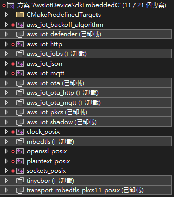

env
cmake 3.x~4.x
vs2022 community

mkdir build
cd build
cmake .. -DCMAKE_POLICY_VERSION_MINIMUM="3.5" -DCMAKE_TOOLCHAIN_FILE=C:/vcpkg/scripts/buildsystems/vcpkg.cmake -DVCPKG_TARGET_TRIPLET=x64-windows-static

./AwsIotDeviceSdkEmbeddedC.sln
build Release

cd build
cmake --install .

~~ unload Not used project ~~
~~ -> unload.png ~~
~~~~
